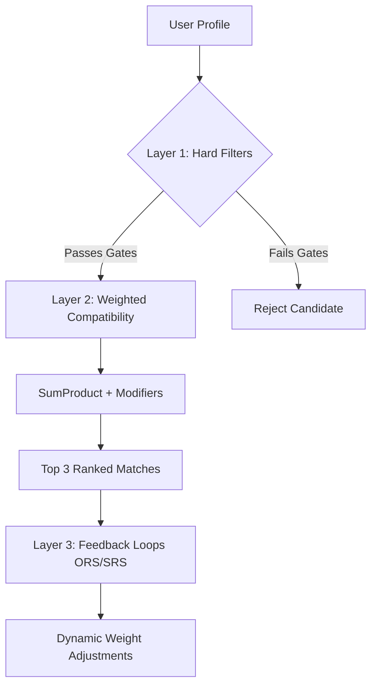

# 🌿 Therapy Matching OS — Single Source of Truth

> [!NOTE]
> This document serves as the absolute, complete, and verified "source of truth" for **Therapy Matching OS**. If this entire project were deleted, any software engineer could rebuild it from scratch—identical in logic, mechanics, styles, and databases—using only this document.

---

## 📖 1. Project Overview & Clinical Hook

**Therapy Matching OS** is an AI-native concept prototype built by a Zero-to-One AI Product Manager (Tharun Gajula). It explores multi-layer compatibility algorithms for client-therapist matching.

Unlike generic directories that sort by price or availability, Therapy Matching OS optimizes for the **Therapeutic Alliance**—the single strongest predictor of clinical success (accounting for ~8% of therapy outcome variance; *Flückiger et al., 2018*). It operates on a high-fidelity 58-point data model designed to match Indian professionals navigating modern concerns (SaaS burnout, joint-family dynamics, caste reckoning, NRI-returnee diaspora stress) with highly specialized, culturally-literate therapists.

### Custom Design System (Meditation & Authority)
Built on a bespoke design system designed to project clinical authority and meditative calm:
*   **Colors (configured in `tailwind.config.ts`):**
    *   `therapy-primary`: `#7A9E7E` (Sage green for growth)
    *   `therapy-primary-deep`: `#3F5E45` (Forest green for clinical authority)
    *   `therapy-secondary`: `#C9B8E0` (Lavender for soothing)
    *   `therapy-accent`: `#D4A574` (Warm sand for grounding warmth)
    *   `therapy-bg`: `#F7F3ED` (Warm white/parchment background)
    *   `therapy-surface`: `#EDEAE3` (Soft gray-brown container backgrounds)
    *   `therapy-text`: `#2A2E2B` (Deep charcoal, off-black readability)
    *   `therapy-text-muted`: `#6F756F` (Soft muted slate for captions)
    *   `therapy-crisis`: `#C9534F` (Crisis red alert)
*   **Typography:**
    *   `serif`: `Fraunces` (`--font-fraunces` variable) for headings to establish medical authority.
    *   `sans`: `Inter` (`--font-inter` variable) for structured interface elements.
*   **Interactions:** Fluid animations (`animate-breathe` with translateY + fade-in), glassmorphism, responsive light-mode forced scaling, and unified mobile-app frame constraints.

---

## ⚙️ 2. Core Architecture: The Three-Layer Matching Engine

The engine is implemented in [lib/engine/matching.ts](file:///d:/000_before%20portfolio_10526/1_Product%20Lab%20Portfolio/therapy-matching-os/therapy-matching-os/lib/engine/matching.ts) and executes a strict pipeline:



### Layer 1: Hard Filters (Binary Gates)
A candidate therapist must pass all active binary filters. Some filters are **rigid (never relaxed)**, while others are **relaxable** in increments when zero candidates are returned:

| ID | Filter Name | Relaxable? | Logic & Rules |
| :--- | :--- | :--- | :--- |
| **H1** | Language Match | **Never** | `user.languages` must share at least 1 overlapping element with `therapist.languages`. |
| **H5** | Queer-Affirmation Gate | **Never** | If `user.sexuality` is `['gay', 'lesbian', 'bi', 'queer', 'bisexual']` or `user.gender` is `['NB', 'trans', 'they/them']`, therapist **must** be `qacpCertified: true`. |
| **H7** | Trauma Specialty Gate | **Never** | If `user.primaryConcerns` contains any concern code starting with `"3."` (Trauma) **and** `user.severity >= 7`, therapist **must** have `traumaSpecialization: true` or have `EMDR` in `modalities`. |
| **H8** | Clinical Severity Gate | **Never** | If `user.severity >= 8`, therapist **must** have an RCI license (`rciNumber !== ''`) or be a psychiatrist (`isPsychiatrist: true`). |
| **H9** | Strong Gender Preference | **Never** | If `user.therapistGenderPref` starts with `"Strong "` (e.g., `"Strong F"` or `"Strong M"`), therapist's `gender` must match exactly (e.g. `gender === 'F'` or `gender === 'M'`). |
| **H14** | Format Compatibility | **Relaxed at Level >= 2** | `user.formatPref` must share at least 1 element with `therapist.formats`. |
| **H3** | Fee Fit | **Relaxed at Level >= 3** | `therapist.fee` must be `<= user.budgetMax * 1.10`. |
| **H4** | Availability Overlap | **Relaxed at Level >= 1** | `user.timePref` must overlap with `therapist.availability` or therapist must offer `"Flexible"`, or user time preference must be `"Flexible"` or `"Irregular"`. |

> [!IMPORTANT]
> The relaxation loop automatically increments `relaxLevel` from `0` to `4` in a `while` loop until at least one candidate passes.

---

### Layer 2: Compatibility Scoring (SumProduct Engine)
For all passing candidates, a similarity score is calculated across individual weighted dimensions.

#### Default Weights (`DEFAULT_WEIGHTS`)
```typescript
export const DEFAULT_WEIGHTS = {
  W1: 18, W2: 9, W3: 9, W4: 6, W5: 5,
  W6: 8, W7: 5, W8: 7, W9: 4, W10: 5,
  W11: 4, W12: 2, W13: 3, W14: 2, W15: 2,
  W16: 3, W17: 2, W18: 2, W19: 1, W20: 2,
  W21: 3, W22: 2, W23: 1, W24: 2, W25: 2,
  W26: 1, W27: 1, W28: 3 // negative modifier
};
```

#### Math & Scoring Formula per Dimension ($W_x$):
Individual dimension scores are evaluated on a `0 - 100` scale:

1.  **W1: Presenting Concern × Specialization**
    *   $\text{Score} = \text{Min}\left(100, \left(\frac{|\text{Overlapping Concerns}|}{|\text{User Primary Concerns}|} \times 100\right) + \text{Bonus}\right)$
    *   $\text{Bonus} = 20$ if the therapist's top 3 specializations include the user's #1 primary concern.
2.  **C-NIP (Complementary-Negative Interpersonal Pattern) Fit (W2 - W5)**
    *   The C-NIP scales represent personality preferences measured from `-15` to `+15` (30-point range):
        *   **W2 (Communication Style - Directiveness):** $100 - \left(\frac{|\text{user.cnip.directiveness} - \text{therapist.cnip.directiveness}|}{30} \times 100\right)$
        *   **W3 (Emotional Warmth - Warmth):** $100 - \left(\frac{|\text{user.cnip.warmth} - \text{therapist.cnip.warmth}|}{30} \times 100\right)$
        *   **W4 (Session Intensity - Emotional Intensity):** $100 - \left(\frac{|\text{user.cnip.emotionalIntensity} - \text{therapist.cnip.emotionalIntensity}|}{30} \times 100\right)$
        *   **W5 (Approach - Past vs. Present Focus):** $100 - \left(\frac{|\text{user.cnip.pastOrientation} - \text{therapist.cnip.pastOrientation}|}{30} \times 100\right)$
3.  **W6: Stage of Change × Therapist Directiveness**
    *   If user in `['Pre-contemplation', 'Contemplation']` and therapist `directiveness <= 5`: $\text{Score} = 100$
    *   If user in `['Preparation', 'Action', 'Maintenance']` and therapist `directiveness >= 6`: $\text{Score} = 100$
    *   Otherwise (Mismatch): $\text{Score} = 30$
4.  **W7: Attachment Style Fit**
    *   If user is `Secure`: $\text{Score} = 80$
    *   If user is `Anxious-preoccupied`: $\text{Score} = 100$ (if therapist `warmth >= 8`), otherwise `40`
    *   If user is `Dismissive-avoidant`: $\text{Score} = 90$ (if therapist `emotionalIntensity <= 0`), otherwise `50`
    *   If user is `Fearful-avoidant`: $\text{Score} = 100$ (if therapist has `traumaSpecialization` and `warmth >= 8`), otherwise `50`
5.  **W8: Modality Fit to Concern**
    *   $\text{Baseline} = 80$
    *   $\text{Score} = 100$ if:
        *   User has concern `8.1` (OCD) and therapist has modality `CBT`
        *   User has concern `3.1` (PTSD) and therapist has modality `EMDR`
        *   User has concern `5.4` (Existential) and therapist has modality `Psychodynamic` or `Humanistic`
6.  **W9: Language Richness & Mother-Tongue**
    *   $\text{Score} = \text{Min}\left(100, \left(\frac{|\text{Shared Languages}|}{|\text{User Languages}|} \times 100\right) + \text{Bonus}\right)$
    *   $\text{Bonus} = 25$ if therapist speaks the user's primary/first language (`user.languages[0]`).
7.  **W10: Cultural Competency**
    *   If user has no cultural sensitivities: $\text{Score} = 100$
    *   Otherwise: $\frac{|\text{User Sensitivities } \cap \text{ Therapist Competencies}|}{|\text{User Sensitivities}|} \times 100$
8.  **W11: Therapist Gender Soft Preference**
    *   If user is `Either`: $\text{Score} = 80$
    *   If user preference matches therapist's gender: $\text{Score} = 100$
    *   Otherwise: $\text{Score} = 50$
9.  **W12: Age Band Fit**
    *   $\text{Baseline} = 80$ (Standardized baseline value for prototype)
10. **W13: Fee Fit**
    *   If therapist fee falls in range `[user.budgetMin, user.budgetMax]`: $\text{Score} = 100$
    *   If fee exceeds `budgetMax` but is within $15\%$ buffer (`<= user.budgetMax * 1.15`): $\text{Score} = 70$
    *   Otherwise: $\text{Score} = 0$
11. **W14: Format Fit**
    *   If therapist matches user's first choice format preference: $\text{Score} = 100$
    *   If matching second choice: $\text{Score} = 80$
    *   Otherwise: $\text{Score} = 60$
12. **W15: Availability Fit**
    *   If user has no time preferences: $\text{Score} = 100$
    *   Otherwise: $\frac{|\text{Overlapping Timeslots}|}{|\text{User Time Preferences}|} \times 100$ (with `"Flexible"` and `"Irregular"` acting as wildcard overlaps).
13. **W16: Therapist Experience vs. Severity**
    *   If user `severity >= 8`: $\text{Score} = 100$ if therapist `yearsExperience >= 10`, `70` if `yearsExperience >= 5`, otherwise `40`.
    *   If user `severity < 8`: $\text{Score} = 100$.
14. **W17: Religious Literacy**
    *   If user has religious sensitivities and therapist has matching competency: $\text{Score} = 100$
    *   If user `religiousSalience <= 3` (Low importance): $\text{Score} = 90$
    *   If user `religiousSalience >= 7` and therapist does **not** support it: $\text{Score} = 40$ (Misalignment)
    *   Otherwise: $\text{Score} = 80$
15. **W18: Caste-Aware Practice Flag**
    *   If user lists `Caste` or `Dalit/Bahujan` in cultural sensitivities: $\text{Score} = 100$ if therapist has `Anti-caste` competency, otherwise `60`.
    *   Otherwise: $\text{Score} = 100$.
16. **W19: NRI/Diaspora Literacy**
    *   If user lists `NRI diaspora` or `NRI dynamics`: $\text{Score} = 100$ if therapist has `NRI/diaspora` competency, otherwise `50`.
    *   Otherwise: $\text{Score} = 100$.
17. **W20: Prior Therapy Fit**
    *   If user is `Experienced`: $\text{Score} = 100$ if therapist modalities include `Psychodynamic`, `IFS`, or `Narrative`, otherwise `80`.
    *   If user is `First-timer`: $\text{Score} = 100$ if therapist has `CBT` or `Solution-focused`, otherwise `80`.
18. **W21: Therapist Warmth**
    *   If user CNIP warmth suggests extreme warmth-seeking (`cnip.warmth <= -7`), therapist must have high warmth (`warmth >= 9`) for $\text{Score} = 100$, otherwise `60`.
    *   Otherwise: $\text{Score} = 80$.
19. **W22: Therapist Challenge**
    *   If user CNIP warmth suggests extreme challenge-seeking (`cnip.warmth >= 7`), therapist must have high challenge (`challenge >= 7`) for $\text{Score} = 100$, otherwise `60`.
    *   Otherwise: $\text{Score} = 80$.
20. **W23: Pace Alignment**
    *   $\text{Baseline} = 80$ (Baseline value)
21. **W24: Session-5 Retention Prior**
    *   Normalized score of therapist's historical retention relative to range $[0.65, 0.95]$:
    *   $\text{Score} = \text{Max}\left(0, \text{Min}\left(100, \frac{\text{therapist.session5Retention} - 0.65}{0.95 - 0.65} \times 100\right)\right)$
22. **W25: Average SRS Bond Prior**
    *   Normalized score of therapist's average SRS score relative to range $[3.2, 4.8]$:
    *   $\text{Score} = \text{Max}\left(0, \text{Min}\left(100, \frac{\text{therapist.avgSrsBond} - 3.2}{4.8 - 3.2} \times 100\right)\right)$
23. **W26: Capacity/Waitlist Prior**
    *   $\text{Baseline} = 100$ (Assumed available within 7 days for the prototype)
24. **W27: Specialization Depth**
    *   $\text{Score} = 100$ if therapist's #1 specialization matches user's #1 primary concern, otherwise `80`.

#### W28: Struggles-with Anti-Match Penalty (Negative Modifier)
If the user's primary concerns overlap with any of the therapist's `strugglesWith` concern tags, `dims.W28` is set to `100`.
*   This triggers a **flat subtraction of 25 points** from the final calculated compatibility average:
    $$\text{Final Score} = \text{Score}_{\text{weighted}} - 25$$

#### Weighted Average calculation:
$$\text{Score}_{\text{weighted}} = \frac{\sum_{x=1}^{27} (\text{dims.W}_x \times \text{weights.W}_x)}{\sum_{x=1}^{27} \text{weights.W}_x}$$

---

### Layer 3: Feedback Learning (ORS + SRS Adaptation Loops)
A post-session feedback loop simulates algorithm self-training. The algorithm uses brief Outcome Rating Scales (ORS) and Session Rating Scales (SRS) to adjust weights dynamically.

#### Math & Constants
*   **Outcome Gain calculation:**
    $$\text{Outcome} = 0.5 \times \left(\frac{\Delta\text{ORS}}{6}\right) + 0.5 \times \left(\frac{\text{SRS}_{\text{mean}}}{40}\right)$$
    *   $\Delta\text{ORS}$ is the change in ORS score relative to reliable change index (`6` points).
    *   $\text{SRS}_{\text{mean}}$ is calculated relative to maximum possible score (`40` points).
*   **Population Mean Expected Performance:** $\mu = 0.75$
*   **Learning Rate (gradient step):** $\eta = 0.05$
*   **Weight Update Formula:**
    For each dimension $x$ where the therapist scored exceptionally well ($\text{dims.W}_x > 80$), adjust weight $W_x$:
    $$\Delta W_x = \eta \times (\text{Outcome} - \mu) \times W_x$$
    $$W_{x, \text{new}} = \text{Max}\left(W_{x, \text{min}}, \text{Min}\left(W_{x, \text{max}}, W_{x, \text{current}} + \Delta W_x\right)\right)$$
*   **Weight Adaptation Boundaries:**
    *   A weight can never drift beyond $\pm 20\%$ of its original default value:
        *   $W_{x, \text{max}} = W_{x, \text{default}} \times 1.20$
        *   $W_{x, \text{min}} = W_{x, \text{default}} \times 0.80$

---

## 📋 3. Complete Clinical Taxonomy (MECE Classification)

The taxonomy maps the exact codes defined in [data/taxonomy.ts](file:///d:/000_before%20portfolio_10526/1_Product%20Lab%20Portfolio/therapy-matching-os/therapy-matching-os/data/taxonomy.ts):

| Code | Clinical Description | Code | Clinical Description |
| :--- | :--- | :--- | :--- |
| **1.1** | Generalized anxiety | **6.1** | Burnout |
| **1.2** | Social anxiety / performance anxiety | **6.2** | Toxic workplace / bullying |
| **1.3** | Panic disorder | **6.3** | Imposter syndrome |
| **1.4** | Health anxiety / illness anxiety | **6.4** | Career transition / layoff |
| **1.5** | Phobias (specific) | **6.5** | Work-life balance / dual-earner conflicts |
| **1.6** | Indian-specific anxiety (timeline, corporate, social) | **6.6** | Performance anxiety (work) |
| **2.1** | Major depressive episode | **6.7** | Indian-specific career (startup hustle, exam prep) |
| **2.2** | Persistent depressive disorder (dysthymia) | **7.1** | ADHD adult |
| **2.3** | Bipolar spectrum | **7.2** | Autism spectrum (adult diagnosis) |
| **2.4** | Perinatal/postpartum depression | **7.3** | Learning differences |
| **2.5** | Seasonal/work-cycle depression | **8.1** | OCD (contamination, checking, harm) |
| **2.6** | Indian-specific depression (adjustment, joint-family) | **8.2** | BDD |
| **3.1** | PTSD (single-event) | **8.3** | Hoarding |
| **3.2** | Complex/childhood trauma | **8.4** | Indian-specific scrupulosity (religious purity) |
| **3.3** | Sexual violence / harassment trauma | **9.1** | Alcohol use disorder |
| **3.4** | Adjustment disorders | **9.2** | Cannabis / other substances |
| **3.5** | Grief (acute, complicated, anticipatory) | **9.3** | Gambling (incl. fantasy-sports) |
| **3.6** | Indian-specific trauma (caste, medical, violence) | **9.4** | Internet / smartphone / porn / gaming |
| **4.1** | Marital conflict | **9.5** | Indian-specific addiction (binge culture, tobacco) |
| **4.2** | Pre-marital / dating issues | **10.1** | Anorexia / restrictive |
| **4.3** | Breakup / divorce adjustment | **10.2** | Bulimia / binge-eating |
| **4.4** | Parenting stress | **10.3** | Sub-clinical disordered eating |
| **4.5** | Adult attachment & dating patterns | **10.4** | Indian-specific body image (wedding, colorism) |
| **4.6** | Sexual concerns | **11.1** | BPD-spectrum / emotion dysregulation |
| **4.7** | Indian-specific family (in-law conflict, joint enmeshment)| **11.2** | NPD-spectrum |
| **5.1** | LGBTQIA+ identity, coming out, minority stress | **11.3** | Avoidant / dependent patterns |
| **5.2** | Gender dysphoria / questioning | **11.4** | Self-esteem / chronic self-criticism |
| **5.3** | Career identity / purpose | **12.1** | Chronic illness adjustment |
| **5.4** | Mid-life crisis | **12.2** | Infertility / reproductive |
| **5.5** | NRI-returnee / diaspora identity | **12.3** | Perimenopause / hormonal |
| **5.6** | Religious/spiritual struggle | **12.4** | Sleep disorders |
| **5.7** | Indian-specific identity (caste reckoning, queer) | **12.5** | Chronic pain |

---

### Daily Reflection Prompts List (30 Items from `data/reflections.ts`)
1.  **on honesty:** *"What is one thing you did not say today that you wish you had?"*
2.  **on stillness:** *"When was the last time you felt truly calm? What were you doing?"*
3.  **on courage:** *"Is there something you have been avoiding? What would happen if you faced it tomorrow?"*
4.  **on connection:** *"Think of someone who makes you feel safe. What is it about them?"*
5.  **on patterns:** *"What pattern in your life keeps repeating? Are you ready to look at it?"*
6.  **on authenticity:** *"What would you do differently if nobody was watching?"*
7.  **on boundaries:** *"Name one boundary you set recently. How did it feel?"*
8.  **on rest:** *"What does rest actually look like for you? Not sleep. Rest."*
9.  **on awareness:** *"Is there a feeling you have been pushing away this week?"*
10. **on self-knowledge:** *"Who do you become when you are stressed? Do you recognize that version of yourself?"*
11. **on the body:** *"What is one thing your body is telling you right now?"*
12. **on perspective:** *"Think about a time you were wrong about someone. What changed your mind?"*
13. **on letting go:** *"What are you holding onto that no longer serves you?"*
14. **on growth:** *"If your younger self could see you now, what would they feel?"*
15. **on contentment:** *"What does enough look like for you today?"*
16. **on vulnerability:** *"When was the last time you asked for help? What stopped you or made it easier?"*
17. **on connection:** *"What is one relationship in your life that deserves more attention?"*
18. **on identity:** *"Are you living by your own values, or values you inherited?"*
19. **on self-compassion:** *"What would change if you treated yourself the way you treat your best friend?"*
20. **on joy:** *"What is one small thing that brought you joy this week? Not happiness. Joy."*
21. **on processing:** *"Is there a conversation you have been replaying in your head? What is it trying to tell you?"*
22. **on anxiety:** *"What does your anxiety want to protect you from?"*
23. **on resilience:** *"Think of a time you surprised yourself. What did you learn?"*
24. **on agency:** *"What would your life look like if you stopped waiting for permission?"*
25. **on belonging:** *"Where do you feel most like yourself? What makes that place different?"*
26. **on forgiveness:** *"What is one thing you need to forgive yourself for?"*
27. **on self-awareness:** *"How do you know when you are not okay? What are your early signals?"*
28. **on growth:** *"What is one belief about yourself that you have outgrown?"*
29. **on narrative:** *"If today was a chapter title in your story, what would it be called?"*
30. **on gratitude:** *"What are you grateful for that you usually take for granted?"*

---

## 👥 4. Developer Truth-Matrix: Personas & Therapist Database

The database properties are hardcoded and verified in their respective files.

### The 22 MECE User Personas (`data/users.ts`)
These represent standard profiles to rigorously test algorithm outcomes across every gate and combination:
1.  **Meera Iyer (29, F):** Product designer in Bangalore. Burnout (`6.1`), relationship anxiety (`4.5`), perfectionism (`11.4`). CNIP warmth-seeking (`-9`), video format.
2.  **Arjun Reddy (34, M):** FAANG manager in Hyderabad. Work performance anxiety (`6.6`), insomnia (`12.4`), anger (`4.1`). Dismissive-avoidant, present-focused structure seeker (`cnip.directiveness: 7`, `warmth: 6` which maps to challenge).
3.  **Fatima Sheikh (27, F):** IB Analyst in Mumbai. Panic (`1.3`), body-image (`10.4`), joint Muslim family conflict (`4.7`). High religious salience (`8`). Needs strong female, QACP-affirmed therapist due to bisexual undertones.
4.  **Rohan Kapoor (31, M):** Closeted gay policy consultant in Delhi. Identity distress (`5.1`), depression (`2.1`), arranged marriage pressure (`1.6`). Requires strong male QACP clinician.
5.  **Anjali Pillai (38, F):** Marketing Director in Chennai. Marital conflict (`4.1`), perimenopause (`12.3`), parental caregiver guilt (`4.7`). Secure attachment, directive problem-solver preference.
6.  **Vikram Joshi (26, M):** Software engineer in Pune. GAD (`1.1`), low self-esteem (`11.4`), parent expectations (`6.7`). Low budget limit (₹1500 max).
7.  **Sanya Khurana (30, F):** Bisexual startup co-founder in Bangalore. Burnout (`6.1`), breakup grief (`4.3`), queer identity validation (`5.1`). Agnostic Sikh, high budget.
8.  **Aman Verma (33, M):** IAS Officer in Delhi. OCD (`8.1`), work paralysis (`6.6`). Severe clinical rating (`8`), needs RCI-registered CBT ERP clinician.
9.  **Priya Banerjee (36, F):** Academic in Kolkata. Postpartum depression (`2.4`), identity loss (`5.7`), family overinvolvement (`4.7`). First-time client, maternal specialist seeker.
10. **Karan Shah (29, M):** Jain family-business heir in Mumbai. Existential drift (`5.4`), dysthymia (`2.2`), dad resentment (`4.7`). Low motivation, slow philosophical exploration seeker.
11. **Lakshmi Nair (32, F):** Lesbian UX researcher in Bangalore. Reverse culture shock (`5.5`), complex grief (`3.5`), partner conflict (`4.1`). NRI-diaspora, out queer.
12. **Rahul Mehta (40, M):** Product manager relocating to Bangalore. Layoff shame (`6.4`), GAD (`1.1`), perfectionism (`11.4`). Moderate budget (₹2000 max).
13. **Tanvi Deshpande (28, NB):** Queer neurodivergent freelance designer in Pune. Gender dysphoria (`5.2`), ADHD (`7.1`), underearning (`6.4`). Estranged, requires NB-affirming clinician.
14. **Neha Agarwal (35, F):** CA in Delhi. PTSD from harassment (`3.3`), severe insomnia (`12.4`), hypervigilance. Severity `9`, trauma seeker (IFS/EMDR).
15. **Imran Qureshi (31, M):** Medical resident in Hyderabad. Imposter syndrome (`6.3`), exhaustion (`6.1`), systemic Islamophobia (`3.6`). Prefer phone call formatting.
16. **Divya Krishnan (37, F):** Homemaker in Chennai. Mid-life depression (`2.6`), lost identity (`5.4`), marital staleness (`4.1`). Deeply religious Hindu, family dynamics sensitivity.
17. **Yash Malhotra (25, M):** IB analyst in Gurgaon. Social anxiety (`1.2`), binge drinking (`9.5`), marriage pressure (`1.6`). Dismissive-avoidant structure seeker.
18. **Aisha D'Souza (30, F):** Journalist in Mumbai. GAD (`1.1`), climate grief (`3.5`), interfaith Catholic-Hindu partner tension (`4.7`). Narrative meaning seeker.
19. **Sandeep Singh (38, M):** Logistics business owner in Delhi. Alcohol abuse (`9.1`), anger (`11.1`), father's death grief (`3.5`). Severity `8`, Jain/Sikh culture, pre-contemplative.
20. **Riya Banerjee-Chen (26, F):** Recruiter in Bangalore. Interracial marriage negotiation (`5.7`), Chinese in-law conflicts (`4.7`), mild depression (`2.2`). Multiculturally sensitive.
21. **Aditya Rao (39, M):** Tech founder (post-exit) in Bangalore. Existential emptiness (`5.4`), career identity loss (`5.3`), hypochondria (`1.4`). Vipassana practitioner, high budget.
22. **Pooja Gupta (33, F):** Schoolteacher in Kolkata. Chronic illness adjustment (`12.1`), health anxiety (`1.4`), body grief (`10.3`). Controlling Marwari mother-in-law dynamics.

---

### The Therapist Database (`data/therapists.ts`)
1.  **Dr. Aanya Krishnan (`t_001`, F):** Clinical Psychologist, Nimhans M.Phil. RCI `A-12345`. Exp: `9` yrs. Modalities: `CBT`, `ACT`, `Psychodynamic`. Specs: `1.1`, `1.3`, `1.2`, `11.4`, `6.1`. Fee: `₹2200`. C-NIP: organisation-oriented, directive (`directiveness: 7`, `warmth: 4` [Challenge]).
2.  **Ritika Bhatia (`t_002`, F):** Counselling Psychologist, TISS MA. Exp: `6` yrs. Modalities: `Person-Centred`, `Narrative`, `EFT`. Specs: `4.5`, `5.1`, `3.5`, `2.4`. Fee: `₹1800`. C-NIP: low direction, high warmth (`directiveness: -6`, `warmth: 9` [Warm]).
3.  **Dr. Aarav Saxena (`t_003`, M):** Psychiatrist, AIIMS MD. Exp: `14` yrs. Modalities: `Pharmacotherapy`, `CBT`. Specs: `8.1`, `2.1`, `2.3`, `7.1`, `1.1`. Fee: `₹3000`. C-NIP: highly directive, low intensity, medication-focused (`directiveness: 9`, `warmth: -5` [Challenge]).
4.  **Tara Menon (`t_004`, F):** Clinical Psychologist, CIP Ranchi + EMDR. RCI `A-23456`. Exp: `12` yrs. Modalities: `EMDR`, `Somatic Experiencing`, `IFS`. Specs: `3.1`, `3.2`, `3.3`. Fee: `₹2800`. QACP and Trauma specialized. C-NIP: low direction, body somatic (`directiveness: -4`, `warmth: 8`).
5.  **Karan Mehta (`t_005`, M):** Clinical Psychologist, Nimhans. RCI `A-34567`. Exp: `10` yrs. Modalities: `CBT`, `DBT`, `MI`. Specs: `9.1`, `9.3`, `11.1`, `4.1` (addiction, men's MH). Fee: `₹2200`. C-NIP: directive, challenging (`directiveness: 5`, `warmth: -8`).
6.  **Shruti Kulkarni (`t_006`, NB ally cis):** Counselling Psychologist, Christ MA. Exp: `7` yrs. Modalities: `Narrative`, `ACT`. Specs: `5.1`, `5.2` (Queer/Trans). Fee: `₹2000`. QACP certified. C-NIP: non-directive, warm (`directiveness: -7`, `warmth: 11`).
7.  **Dr. Farah Ahmed (`t_007`, F):** Psychiatrist, NIMHANS MD. Exp: `13` yrs. Modalities: `Pharmacotherapy`, `Psychodynamic`. Specs: `2.4`, `1.1`, `5.6`. Fee: `₹2500`. Competencies: Muslim faith-integrative. C-NIP: balanced (`directiveness: 0`, `warmth: 7`).
8.  **Aditi Roy (`t_008`, F):** Counselling Psychologist, Calcutta MA. Exp: `4` yrs. Modalities: `CBT`, `Schema`, `Mindfulness`, `SFBT`. Specs: `1.1`, `2.1`, `11.4`, `4.7`. Fee: `₹1200`. C-NIP: slightly directive, warm (`directiveness: 6`, `warmth: 3`).
9.  **Vikrant Sharma (`t_009`, M):** Clinical Psychologist, Delhi M.Phil. RCI `A-45678`. Exp: `18` yrs. Modalities: `Psychodynamic`, `Gestalt`. Specs: `5.4`, `6.1`, `4.1` (Existential). Fee: `₹3500`. C-NIP: non-directive, low warmth, slow depth (`directiveness: -9`, `warmth: -2`).
10. **Ananya Iyer (`t_010`, F):** Clinical Psychologist, Nimhans. RCI `A-56789`. Exp: `8` yrs. Modalities: `CBT` (ERP). Specs: `8.1`, `1.5`, `1.4`, `1.3` (OCD). Fee: `₹2400`. C-NIP: pure behavioral directiveness (`directiveness: 10`, `warmth: -5`).
11. **Ravi Pillai (`t_011`, M):** Counselling Psychologist, DBT-Linehan. Exp: `9` yrs. Modalities: `DBT`, `ACT`, `IPT`. Specs: `11.1`, `10.2`, `2.1`. Fee: `₹2000`. QACP certified. C-NIP: directive, balanced warmth (`directiveness: 6`, `warmth: 0`).
12. **Megha Singh (`t_012`, F):** Clinical Psychologist + Gottman Couples. RCI `A-67890`. Exp: `15` yrs. Modalities: `Gottman Method`, `EFT`. Specs: `4.1`, `4.7` (Couples, marital conflict). Fee: `₹2800`. C-NIP: balanced, warm (`directiveness: 5`, `warmth: 7`).
13. **Kabir Joseph (`t_013`, M):** Counselling Psychologist, Christ MA. Exp: `7` yrs. Modalities: `Humanistic`, `Narrative`, `ACT`. Specs: `5.1`, `5.6`, `4.5` (Men, Christian identity). Fee: `₹1800`. QACP certified. C-NIP: low direction, warm (`directiveness: -5`, `warmth: 9`).
14. **Dr. Neelam Kaur (`t_014`, F):** Clinical Psychologist, PGI Chandigarh M.Phil. RCI `A-78901`. Exp: `22` yrs. Modalities: `EMDR`, `Psychodynamic`, `CBT`. Specs: `3.2`, `3.6`, `3.1`. Fee: `₹3200`. Trauma specialized. C-NIP: balanced, warm (`directiveness: 0`, `warmth: 6`).
15. **Tanmay Bose (`t_015`, M):** Counselling Psychologist. Exp: `5` yrs. Modalities: `ACT`, `CBT`, `MI`, `IFS`. Specs: `6.4`, `7.1`, `6.1`, `6.7` (Startup, ADHD). Fee: `₹1500`. QACP certified. C-NIP: directive, challenging (`directiveness: 4`, `warmth: -6`).
16. **Sneha Pothineni (`t_016`, F):** Clinical Psychologist + IFS L1. RCI `A-89012`. Exp: `10` yrs. Modalities: `IFS`, `Psychodynamic`. Specs: `4.7`, `4.5`, `3.2`. Fee: `₹2400`. C-NIP: highly non-directive, warm, attachment-focused (`directiveness: -8`, `warmth: 10`).

---

## 🛠️ 5. Technical Stack & File Directory Map

### Tech Stack & Dependencies (`package.json`)
*   **Core:** Next.js `16.2.4` (React `19.2.4`), TypeScript `^5`, ESLint `^9`
*   **Styling:** Tailwind CSS `^4` (via `@tailwindcss/postcss` config integration)
*   **Icons:** `lucide-react` `^1.14.0`
*   **Build Scripts:**
    *   `dev`: `next dev` (starts developer workspace server)
    *   `build`: `next build` (builds production asset)
    *   `start`: `next start` (starts serving built client)
    *   `lint`: `eslint` (runs code check)

---

### Project File Directory Map
Here is the exact layout of the codebase:

```bash
therapy-matching-os/
├── AGENTS.md               # Next.js custom agent instructions
├── CLAUDE.md               # Standard CLI cheat sheet instructions
├── README.md               # Portfolio project introduction page
├── tailwind.config.ts      # Custom theme color configurations and design system fonts
├── tsconfig.json           # TS Compiler options, target ES2017, modular bundler aliases
├── package.json            # Script definitions and dependency constraints
├── postcss.config.mjs      # Tailwind post-CSS compilation instructions
├── eslint.config.mjs       # Lint rule sets
├── types/                  # Core type validation schemas
│   ├── engine.ts           # Algorithm interfaces (UserProfile, TherapistProfile, MatchResult)
│   └── index.ts            # UI form schemas (OnboardingData, Therapist)
├── data/                   # Hardcoded JSON data stores
│   ├── demo.ts             # Default onboarding persona data (Meera Persona)
│   ├── reflections.ts      # Master array of 30 daily reflection prompt strings
│   ├── therapists.ts       # Database of 16 detailed therapist records
│   └── users.ts            # Database of 22 MECE test personas
├── lib/                    # Computational algorithms and math utils
│   ├── clinical.ts         # PCOMS ORS threshold constants and interpretations
│   └── engine/             
│       ├── explainMatch.ts # Text-generation templates compiling 3-sentence "why matched" paragraph
│       └── matching.ts     # 3-Layer algorithm logic, hard filtering, weighted similarity, learning updates
├── contexts/               
│   └── TherapyContext.tsx  # React State Provider tracking profile, SRS, ORS, reflections (sessionStorage hydrated)
├── components/             # Reusable interactive components
│   ├── AIAssistant.tsx     # Context-aware floating therapeutic chat drawer
│   ├── BottomNav.tsx       # Meditative floating bottom navigation dock (Home, Journey, Reflections, Profile)
│   └── LayoutClient.tsx    # Responsive body wrapper forcing active viewport boundaries
└── app/                    # Routing stage pages
    ├── globals.css         # Custom utility keyframes (@keyframes breathe) and light-mode force overrides
    ├── layout.tsx          # HTML boundary binding fonts (Fraunces & Inter) and SEO context metadata
    ├── page.tsx            # Meditative landing page prompting clients to begin onboarding
    ├── compare/            # Interactive slides presenting deep empirical clinical literature
    ├── onboarding/         # Five-chapter interactive questionnaire generating active UserProfile
    ├── matches/            # Results view matching active profile against therapist database (with persona selector)
    ├── match/              # Meet your match detail profile page containing waitlist booking controls
    ├── checkin/            # Pre-session 4-domain Outcome Rating Scale (ORS) slide survey
    ├── feedback/           # Post-session 3-domain Session Rating Scale (SRS) feedback survey
    ├── reflections/        # Daily mental-check reflection writing board
    ├── therapist-dashboard/# Professional portal showing performance trends and alliance-rupture alerts
    ├── booked/             # Success confirmations for 15-minute introductory sessions
    ├── journey/            # Patient longitudinal visual logs, mood trackers, wellbeing pulse (ORS/SRS trend charts)
    ├── loading.tsx         # Page transition splash loader
    └── [admin/etc...]      # Placeholder routes for administrative/profile configuration scaling
```

---

## ❓ 6. Project Unknowns & Confirmation Checklist

> [!WARNING]
> The following details are either missing from code configuration files or require user verification before deploying to production:

*   **Live Deployment URL:** The Vercel link in `README.md` is currently a placeholder: `[Vercel Link (Insert Link Here)]`. *Action: Update with live link once deployed.*
*   **Waitlist Booking Action Hook:** The waitlist/booking button currently points to dummy routes (`/booked` or `/matches`). In a production service, these would trigger an database integration (e.g. Supabase, PostgreSQL) or a Calendar webhook (e.g. Cal.com/Calendly).
*   **Therapeutic Chat assistant API Key:** The therapeutic chatbot assistant (`components/AIAssistant.tsx`) uses client-side simulated responses. Integrate an LLM (e.g. OpenAI/Gemini) if real-time interactive journaling is desired.

---
*Document compiled and verified by Antigravity AI on 2026-05-31.*
