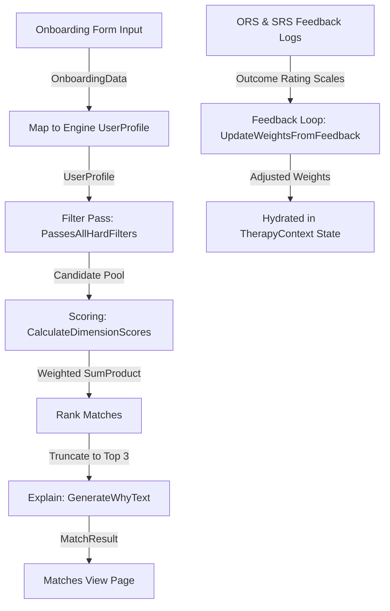

# 🌿 Therapy Matching OS — Single Source of Truth
**Date Compiled**: June 20, 2026

---

## 📖 1. Project Executive Summary & Philosophy

### Core Purpose
**Therapy Matching OS** is an AI-native concept prototype built to explore multi-layer compatibility algorithms for matching clients with mental health professionals. Unlike traditional directories that sort by price, proximity, or simple availability, Therapy Matching OS optimizes for the **Therapeutic Alliance**—the single strongest predictor of clinical success (accounting for approximately 8% of therapy outcome variance; *Flückiger et al., 2018*). 

The platform operates on a high-fidelity 58-point data model designed to match Indian professionals navigating modern systemic and culturally-specific stressors (SaaS burnout, joint-family dynamics, caste reckoning, NRI-returnee diaspora stress) with specialized, culturally-literate therapists.

### Architectural Pivot
Therapy Matching OS shifts the matching paradigm from simple keyword search to a structured three-layer process:
1. **Layer 1: Hard Filters (Binary Gates)**: Guarantees essential safety and identity alignment. Rigid criteria (such as language matching, queer-affirmation, and high severity licensure) are enforced first. Relaxable criteria (fee buffers, formats, availability overlaps) are relaxed in increments from level 0 to 4 only if zero matches are found.
2. **Layer 2: Weighted Compatibility Scoring (SumProduct Engine)**: Computes a multi-dimensional matching score using a weighted similarity average across 27 dimensions (W1 to W27) and a negative anti-match penalty (W28).
3. **Layer 3: Feedback Loops (ORS/SRS Adaptation)**: Implements a simulated gradient descent that dynamically modifies algorithm weights based on post-session Outcome Rating Scale (ORS) and Session Rating Scale (SRS) feedback, preventing future dropouts.

### Design System & Aesthetic Rules
Built to project clinical authority, transparency, and meditative calm:
*   **Colors (Configured in `tailwind.config.ts`):**
    *   `therapy-primary`: `#7A9E7E` (Sage green symbolizing growth and safety)
    *   `therapy-primary-deep`: `#3F5E45` (Forest green projecting clinical authority)
    *   `therapy-secondary`: `#C9B8E0` (Lavender for soothing and ease)
    *   `therapy-accent`: `#D4A574` (Warm sand for grounding warmth)
    *   `therapy-bg`: `#F7F3ED` (Warm white/parchment background)
    *   `therapy-surface`: `#EDEAE3` (Soft gray-brown for container backgrounds)
    *   `therapy-text`: `#2A2E2B` (Deep charcoal for off-black readability)
    *   `therapy-text-muted`: `#6F756F` (Soft muted slate for secondary captions)
    *   `therapy-crisis`: `#C9534F` (Crisis red alert)
*   **Typography:**
    *   `serif`: `Fraunces` heading font to establish clinical trust and medical authority.
    *   `sans`: `Inter` body font for modern, legible user interface controls.
*   **Interactions:** Fluid animations (`animate-breathe` breathing scale/fade, slide-ups), glassmorphism, forced light-mode scaling, and a mobile-first, centered frame layout (`max-w-md mx-auto`) to mimic a native app experience.

---

## 📦 2. Production Dependencies

The following dependencies are extracted directly from `package.json`:

### Production Dependencies
*   `next`: `16.2.4` (React 19 framework)
*   `react`: `19.2.4` (Core rendering engine)
*   `react-dom`: `19.2.4` (Document Object Model rendering)
*   `lucide-react`: `^1.14.0` (Unified UI iconography)

### DevDependencies
*   `tailwindcss`: `^4` (Styling engine)
*   `@tailwindcss/postcss`: `^4` (PostCSS wrapper for Tailwind v4)
*   `typescript`: `^5` (Static type validation)
*   `eslint`: `^9` (Code linting and checking)
*   `eslint-config-next`: `16.2.4` (Next.js eslint presets)
*   `@types/node`: `^20` (Node environment types)
*   `@types/react`: `^19` (React type mappings)
*   `@types/react-dom`: `^19` (React DOM type mappings)

---

## 🗄️ 3. Database Schemas & Data Pipeline

The project uses static, hardcoded data stores that represent relational schemas in the frontend. All interfaces are declared in `types/engine.ts`.

### User Profile Schema (`UserProfile`)
Represents the structural data collected during onboarding:
```typescript
export interface UserProfile {
  id: string;
  name: string;
  age: number;
  gender: string; // 'M' | 'F' | 'NB'
  pronouns: string;
  sexuality: string;
  city: string;
  occupation: string;
  industry: string;
  languages: string[];
  primaryConcerns: ConcernTag[]; // 1 to 3 items
  secondaryConcerns: ConcernTag[];
  durationMonths: number;
  severity: number; // 1-10 (clinical scale)
  familyStructure: string;
  familyDynamics: string;
  religion: string;
  religiousSalience: number; // 1-10
  culturalSensitivities: string[];
  attachmentStyle: AttachmentStyle;
  stageOfChange: StageOfChange;
  cnip: CNIP;
  therapistGenderPref: 'M' | 'F' | 'NB' | 'Either' | 'Strong F' | 'Strong M';
  priorTherapy: PriorTherapy;
  budgetMin: number;
  budgetMax: number;
  formatPref: ('Video' | 'Phone' | 'In-person' | 'Chat')[];
  timePref: string[];
  dropoutTriggers: string[];
  stayTriggers: string[];
}
```

### Therapist Profile Schema (`TherapistProfile`)
Represents the clinical therapist record database (`data/therapists.ts`):
```typescript
export interface TherapistProfile {
  id: string;
  name: string;
  gender: string; // 'M' | 'F' | 'NB'
  ageRange: string; // e.g. "30-35"
  city: string;
  credentials: string;
  rciNumber: string; // RCI License number (if Clinical Psychologist)
  yearsExperience: number;
  modalities: string[]; // Modalities like 'CBT', 'ACT', 'EMDR', etc.
  specializations: ConcernTag[]; // Clinical concern codes
  languages: string[];
  cnip: CNIP;
  warmth: number; // 1-10
  directiveness: number; // 1-10
  challenge: number; // 1-10
  culturalCompetencies: string[];
  qacpCertified: boolean; // Queer Affirmative Counselling Practice certified
  traumaSpecialization: boolean; // Certified trauma specialist
  isPsychiatrist: boolean; // True if MBBS MD Psychiatrist
  fee: number; // Price in INR
  formats: ('Video' | 'Phone' | 'In-person' | 'Chat')[];
  availability: string[]; // Availabilities like 'Flexible', 'Weekday evenings', etc.
  session5Retention: number; // Historical percentage: 0.0 - 1.0
  avgSrsBond: number; // Historical average Session Rating Scale score: 0.0 - 5.0
  about: string;
  bestWith: string[]; // Patient type keywords
  strugglesWith: ConcernTag[]; // Anti-match tags (poor efficacy matches)
}
```

### Supporting Schemas
*   **CNIP (Complementary-Negative Interpersonal Pattern)**: Scales directiveness, emotional intensity, past-vs-present focus, and warmth on a `-15` to `+15` scale:
    ```typescript
    export interface CNIP {
      directiveness: number; // -15 to +15
      emotionalIntensity: number; // -15 to +15
      pastOrientation: number; // -15 to +15
      warmth: number; // -15 to +15
    }
    ```
*   **MatchResult**: Represents the matched therapist along with explanation:
    ```typescript
    export interface MatchResult {
      therapist: TherapistProfile;
      matchScore: number;
      dimensions: Record<string, number>;
      topDimensions: TopDimension[];
      whyText: string; // Dynamic 3-sentence match explanation paragraph
    }
    ```

### Data Pipeline Flow


---

## 🧮 4. System Engines & Algorithms

The system mechanics are defined in `lib/engine/matching.ts` and `lib/engine/explainMatch.ts`.

### Layer 1: Hard Filters (Binary Gates)
Checks 9 gates. Rigid gates reject candidates immediately. Relaxable gates relax criteria as the loop moves from level 0 to 4 if the search yields zero candidates:

| ID | Gate | Relaxable? | Rule Condition |
| :--- | :--- | :--- | :--- |
| **H1** | Language Match | **Never** | `user.languages` must share at least 1 overlapping element with `therapist.languages`. |
| **H5** | Queer-Affirmative | **Never** | If `user.sexuality` is queer or `user.gender` is trans/non-binary, therapist must have `qacpCertified: true`. |
| **H7** | Trauma Gate | **Never** | If user concern starts with `'3.'` (Trauma) and `user.severity >= 7`, therapist must have `traumaSpecialization: true` or `EMDR` in `modalities`. |
| **H8** | Severity Gate | **Never** | If `user.severity >= 8`, therapist must have an RCI license (`rciNumber !== ''`) or be a psychiatrist (`isPsychiatrist: true`). |
| **H9** | Gender Preference | **Never** | If `user.therapistGenderPref` starts with `"Strong "` (e.g. `"Strong F"`), therapist's `gender` must match exactly. |
| **H14** | Format Fit | **Relaxed at Level >= 2** | `user.formatPref` must share at least 1 element with `therapist.formats`. |
| **H3** | Fee Fit | **Relaxed at Level >= 3** | `therapist.fee <= user.budgetMax * 1.10`. |
| **H4** | Availability | **Relaxed at Level >= 1** | `user.timePref` must overlap with `therapist.availability` or therapist/user has `"Flexible"`. |

### Layer 2: Compatibility Scoring (SumProduct Engine)
For all passing therapists, we compute scores (0-100) across 27 dimensions (`W1` to `W27`), applying default weights:

$$\text{Score}_{\text{weighted}} = \frac{\sum_{x=1}^{27} (\text{dims.W}_x \times \text{weights.W}_x)}{\sum_{x=1}^{27} \text{weights.W}_x}$$

If `dims.W28` (Struggles-with Anti-Match) is $100$ (user concern overlaps with `therapist.strugglesWith`), a flat **25-point penalty** is subtracted:
$$\text{Final Score} = \text{Score}_{\text{weighted}} - 25$$

#### Key Dimension Formulae
*   **W1 (Presenting Concern):** $\text{Min}(100, (\text{Overlap}/\text{User Concerns}) \times 100 + \text{Bonus})$, where $\text{Bonus} = 20$ if therapist's top 3 specs include user's #1 concern.
*   **W2-W5 (C-NIP Scales):** Evaluated against user-therapist distance:
    $$\text{Score} = 100 - \left(\frac{|\text{user.cnip.dimension} - \text{therapist.cnip.dimension}|}{30} \times 100\right)$$
*   **W6 (Stage of Change):** If user in Pre-contemplation/Contemplation and therapist directiveness $\le 5$, or user in Action/Maintenance and therapist directiveness $\ge 6$, score is $100$, else $30$.
*   **W9 (Language Richness):** $(\text{Shared}/\text{User Languages}) \times 100 + 25$ bonus if therapist speaks user's first language.
*   **W13 (Fee Fit):** $100$ if within budget; $70$ if within $15\%$ buffer; $0$ otherwise.
*   **W24 & W25 (Priors):** Normalize retention $[0.65, 0.95]$ and SRS bond $[3.2, 4.8]$ to a $0-100$ scale.

### Layer 3: Feedback Learning (ORS + SRS Adaptation Loops)
Simulates algorithm optimization by adjusting weights based on patient outcomes:
*   **Outcome Gain calculation:**
    $$\text{Outcome} = 0.5 \times \left(\frac{\Delta\text{ORS}}{6}\right) + 0.5 \times \left(\frac{\text{SRS}_{\text{mean}}}{40}\right)$$
*   **Update Rule:** If therapist scores $>80$ on dimension $x$, adjust weight $W_x$:
    $$\Delta W_x = \eta \times (\text{Outcome} - \mu) \times W_x$$
    $$W_{x, \text{new}} = \text{Max}\left(W_{x, \text{min}}, \text{Min}\left(W_{x, \text{max}}, W_{x, \text{current}} + \Delta W_x\right)\right)$$
    *   *Constants*: Learning rate $\eta = 0.05$, expected performance $\mu = 0.75$.
    *   *Boundaries*: Weights cannot drift beyond $\pm 20\%$ of their default value.

### Text Explanation Engine (`explainMatch.ts`)
Synthesizes a 3-sentence narrative explaining the match by picking the top 3 contributing dimensions (highest $\text{Score}_x \times \text{Weight}_x$) and passing them to string templates:
*   *Example (W2)*: *"You said you prefer structure and clear direction. Dr. Aanya is known for being organized and action-oriented in sessions."*
*   *Example (QACP)*: *"Dr. Farah is QACP-certified, ensuring your identity is understood and affirmed rather than treated as a 'problem' to be solved."*

---

## 🖥️ 5. Frontend Navigation & Pages

The application is structured inside Next.js `/app` router. It restricts page displays to a mobile viewport container (`max-w-md mx-auto`) inside `LayoutClient.tsx`.

### 1. Root / Welcome (`app/page.tsx`)
*   **Role**: Landing page promoting therapeutic matching.
*   **Components**: Welcome banner, 3-step timeline instruction card, and a start button to trigger `/onboarding`.

### 2. Onboarding Questionnaire (`app/onboarding/page.tsx`)
*   **Role**: Multi-step onboarding collecting client clinical and cultural data.
*   **Structure**: 12 chapters representing clinical, demographic, stylistic, cultural, and logistical questions.
*   **Sub-Routing**:
    *   *Crisis Redirection*: If thoughts of self-harm are selected, redirects to `/support`.
    *   *Listen Mode Redirection*: If user indicates they only want someone to listen, routes to `/listens`.
    *   *Success*: Maps inputs to `UserProfile` object, saves to `sessionStorage`, and transitions to `/matches`.

### 3. Matches Dashboard (`app/matches/page.tsx`)
*   **Role**: Core outcome screen displaying matched therapists.
*   **Components**:
    *   *Developer Toggle*: Selects one of the 22 MECE test personas to observe algorithm outcomes instantly.
    *   *Top Match Card*: Showcases the highest match with its score, initials, credentials, and the generated explanation.
    *   *Alternative Matches*: Collapsible list showing the second and third matches.

### 4. Meet Your Match (`app/match/page.tsx`)
*   **Role**: Detail profile view of the selected therapist.
*   **Components**: Intro video player block (1-min watch simulation), specialized credentials badge array, logistics panel (fee, availability), and booking actions.
*   **Waitlist Logic**: If therapist has no immediate openings, prompts user with a warning and option to view alternative matches.

### 5. Pre-Session Check-In (`app/checkin/page.tsx`)
*   **Role**: Slide-based Outcome Rating Scale (ORS) assessment.
*   **Variables**: 4 sliders mapping Personal, Interpersonal, Social, and Overall well-being (0 to 10 scale). Saves aggregate score to `sessionStorage` history.

### 6. Post-Session Feedback (`app/feedback/page.tsx`)
*   **Role**: Session Rating Scale (SRS) feedback questionnaire.
*   **Variables**: Rates Relationship, Goals, and Approach on a 1 to 5 scale. On submit, triggers the Layer 3 algorithm adjustment loop.

### 7. Daily Reflections (`app/reflections/page.tsx`)
*   **Role**: Journaling page displaying reflection prompts.
*   **Structure**: Selects a prompt from a pool of 30 items based on day of the year. Contains text area and a history drawer loading previous entries from `sessionStorage`.

### 8. Therapist Dashboard (`app/therapist-dashboard/page.tsx`)
*   **Role**: Clinician portal tracking active ruptures and retention metrics.
*   **Alliance-Rupture Alert**: If the client's last SRS score is $<12$ (out of 15), triggers a red banner warning the therapist with a clinical repair script.

### 9. Patient Journey Map (`app/journey/page.tsx`)
*   **Role**: Longitudinal patient tracking view.
*   **Components**: Mood tracking selectors (Good, Okay, Tough), calendar cards, micro-journal prep card, and the "Wellbeing Pulse" (renders a bar chart of the last 5 ORS checks).

---

## 🛠️ 6. Developer Operations Runbook

### Environment Variables
This concept prototype does not require external database credentials or API keys. It runs fully client-side on session-hydrated storage.
*   If integrating an LLM into the `AIAssistant.tsx` chatbot:
    `NEXT_PUBLIC_GEMINI_API_KEY` (or similar endpoint) must be set in `.env.local`.

### Local Development Setup
1.  **System Requirements**: Node.js `v18.x` or higher installed.
2.  **Install Dependencies**:
    ```bash
    npm install
    # On Windows environments with disabled script executions:
    npm.cmd install
    ```
3.  **Run Development Server**:
    ```bash
    npm run dev
    # Or explicitly:
    npm.cmd run dev
    ```
4.  **Open Browser**: Navigate to `http://localhost:3000`.

### Building for Production
Verify typescript compiles and build output asset package:
```bash
npm run build
# Or explicitly:
npm.cmd run build
```
This packages the client code using Next.js build optimization inside `.next/`. Runs `next start` to run production server on local port.
